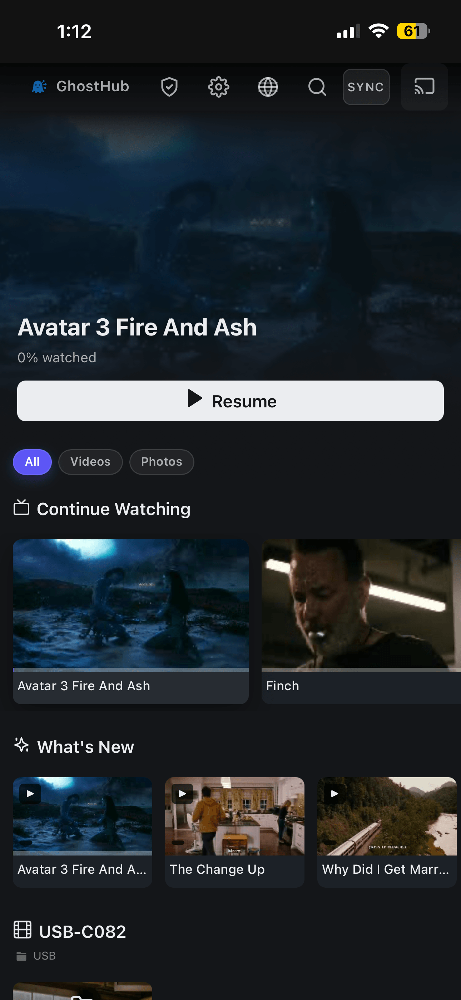
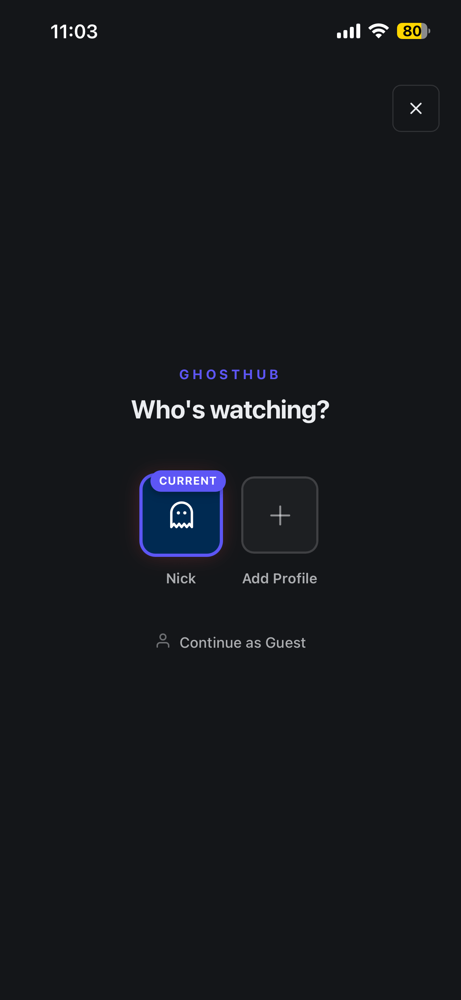
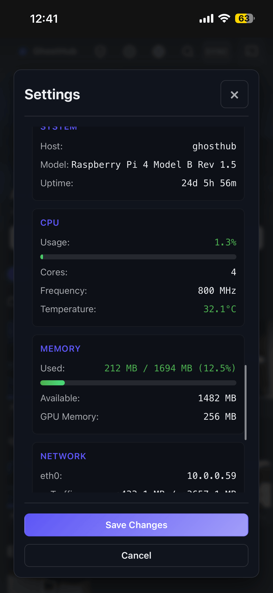

# GhostHub

**A self-hosted media server for Raspberry Pi 4. Browse your photos and videos from any device on your network — no cloud, no account, no subscription.**

<p>
  <a href="LICENSE"></a>
  <a href="https://github.com/BleedingXiko/GhostHub/releases/tag/v5.0.1"></a>
  <a href="https://github.com/BleedingXiko/GhostHub/releases/tag/B5"></a>
  
  
</p>

<p>
  <a href="https://github.com/BleedingXiko/GhostHub/releases/tag/v5.0.1"><strong>Latest Release</strong></a>
  · <a href="docs/QUICK_START.md"><strong>Quick Start</strong></a>
  · <a href="docs/FLASH_GHOSTHUB_IMAGE.md"><strong>Flash Image</strong></a>
  · <a href="docs/DIY_INSTALL.md"><strong>DIY Install</strong></a>
  · <a href="docs/HOW_TO_USE_GHOSTHUB.md"><strong>User Guide</strong></a>
  · <a href="CONTRIBUTING.md"><strong>Contributing</strong></a>
  · <a href="SECURITY.md"><strong>Security</strong></a>
</p>

<p>
  
  
  
</p>

> **Compatibility:** GhostHub's Pi install path targets Raspberry Pi 4 running `2022-01-28-raspios-bullseye-armhf-lite`. It is not a generic installer for every Raspberry Pi OS image.

---

## What It Does

GhostHub turns a Raspberry Pi 4 and USB storage into a private media server for your home network. Open it from a phone, tablet, laptop, desktop browser, or HDMI display to browse, play, upload, download, organize, and share your photo and video library.

GhostHub supports two network modes:
- **Home network** — the Pi connects to your router by Ethernet and is reachable from devices on that LAN, including phones and laptops on the router's Wi-Fi.
- **Access point** — the Pi broadcasts its own `GhostHub` Wi-Fi network for portable or offline use.

## Features

- Streaming and Gallery layouts for photos and videos
- Profiles with avatars, resume progress, and per-user history
- Upload, download, rename, delete, and move actions
- Categories, hidden folders, playlists, sorting, and search
- Subtitles for video (`.srt .vtt .ass .ssa`), auto-converted via ffmpeg
- TV casting to an HDMI display attached to the Pi
- Sync watching and chat between connected viewers
- Admin panel: updates, storage, Wi-Fi, cache, restart, logs, system status
- Offline access-point mode
- Optional remote access via Cloudflare Tunnel or a Tailscale/Headscale mesh

## Supported Media

Plays in any modern browser without extra setup:

```text
Video    .mp4 (H.264/AAC), .webm
Images   .jpg .jpeg .png .gif .webp  (.heic on Safari)
Subs     .srt .vtt .ass .ssa  (text tracks auto-extracted via ffmpeg)
```

Plays through **[GhostStream](https://github.com/BleedingXiko/GhostStream)**, an optional companion transcoder that runs on a separate machine:

```text
.mkv .avi .mov .wmv .flv .ts .m2ts .mpg .vob
HEVC / H.265 / AV1 / VP9 video
AC3 / DTS / TrueHD / E-AC3 audio
Anything above ~25 Mbps over remote links
```

GhostStream is **not bundled** and is **off by default**. Without it, files in the second list show a "No transcoding server connected" message instead of playing. Most phone recordings, screen captures, and downloaded `.mp4` files are in the first list and play directly.

## Quick Start

### Option 1 — Flash the prebuilt image (fastest)

1. Download the GhostHub SD card image from the [ready-to-flash image release built on v5.0.1](https://github.com/BleedingXiko/GhostHub/releases/tag/B5).
2. Flash it to a microSD card with [Raspberry Pi Imager](https://www.raspberrypi.com/software/) or balenaEtcher.
3. Boot the Pi, connect your phone or laptop to the `GhostHub` Wi-Fi network, and open `http://ghosthub.local` (or `http://192.168.4.1`).

### Option 2 — DIY install on stock Raspberry Pi OS

Flash the exact supported base image with Raspberry Pi Imager v1.8.5:

```text
2022-01-28-raspios-bullseye-armhf-lite
https://downloads.raspberrypi.org/raspios_lite_armhf/images/raspios_lite_armhf-2022-01-28/2022-01-28-raspios-bullseye-armhf-lite.zip
```

In Imager's advanced options, set:

```text
Hostname: ghosthub
Username: ghost
Enable SSH: yes
Password: (your choice)
```

SSH into the Pi, then run the installer:

```bash
ssh ghost@ghosthub.local

curl -L -o install_ghosthub.sh \
  https://github.com/BleedingXiko/GhostHub/releases/download/v5.0.1/install_ghosthub.sh
chmod +x install_ghosthub.sh
sudo ./install_ghosthub.sh
```

The installer downloads `Ghosthub_pi_github.zip` from GitHub Releases, installs system dependencies, configures the systemd service, prepares USB, access-point, and HDMI support, then starts GhostHub.

### Option 3 — Deploy local source from your computer

If you cloned this repo and want to deploy your working tree to a Pi instead of installing a public release:

```bash
./scripts/deploy_to_pi.sh        # macOS / Linux
.\scripts\deploy_to_pi.ps1       # Windows PowerShell
```

The deploy CLI builds a local `ghostpack` ZIP, uploads it to the Pi, and does not use GitHub Releases.

See [Quick Start](docs/QUICK_START.md), [Flash Image](docs/FLASH_GHOSTHUB_IMAGE.md), or [DIY Install](docs/DIY_INSTALL.md) for detailed setup instructions.

## How It Runs

```text
Raspberry Pi 4 + USB storage
        |
        v
GhostHub service on port 5000
        |
        +-- phone / tablet / desktop browser
        +-- HDMI kiosk / TV display
        +-- optional mesh or tunnel access
```

GhostHub uses Python 3.9, Flask, and SPECTER on the backend; modular ES modules and RAGOT on the frontend; and SQLite for local state. It is packaged for Raspberry Pi, but the source tree remains a normal Flask project for local development.

## Updates

Updates ship through [GitHub Releases](https://github.com/BleedingXiko/GhostHub/releases). The admin UI checks the latest `vX.Y.Z` release tag, downloads the installer, validates it, and schedules the update with `systemd-run`.

Updates preserve `instance/`, `venv/`, `headscale`, and `cloudflared`.

Public release assets:
- `Ghosthub_pi_github.zip`
- `install_ghosthub.sh`

The ready-to-flash SD card image is published separately by the maintainer. The GitHub release workflow does not build it.

See [Release Process](docs/RELEASES.md).

## Manual install flags

```bash
sudo ./install_ghosthub.sh --version v5.0.1                          # pin a release tag
sudo ./install_ghosthub.sh --local-zip /path/to/Ghosthub_pi_github.zip   # install from a local zip
sudo ./install_ghosthub.sh --local-only                              # use /tmp/ghosthub_deploy.zip
```

## Development

GhostHub targets Python 3.9. Use a Python 3.9 virtual environment so local tests match Pi deployments.

```bash
python3.9 -m venv venv
source venv/bin/activate
pip install -r requirements.txt
cd static/js && npm install && cd ../..
python ghosthub.py
```

On Windows PowerShell, use `py -3.9 -m venv venv` and `.\venv\Scripts\Activate.ps1`; the rest is the same with backslash paths.

Run the full test suite:

```bash
./venv/bin/python scripts/run_all_tests.py
```

Run a focused subset:

```bash
./venv/bin/python -m pytest tests/test_admin_routes.py -v
cd static/js && npm test && cd ../..
```

## Architecture

- Backend routes and services use the [`specter-runtime`](https://github.com/BleedingXiko/specter) package (Service / Controller / Handler primitives).
- Frontend modules use the [RAGOT](https://github.com/BleedingXiko/RAGOT) runtime at `static/js/libs/ragot.esm.min.js`.
- SQLite stores app state under `instance/`.
- Raspberry Pi service setup is handled by `install_ghosthub.sh`.
- Release ZIPs are built with `scripts/ghostpack.py --zip`.

Start with [Architecture](docs/ARCHITECTURE.md) before changing internals.

## Related Projects

GhostHub uses three open-source companion projects:

- **[SPECTER](https://github.com/BleedingXiko/specter)** — backend runtime for services, controllers, handlers, and the event bus. Installed from PyPI as `specter-runtime`.
- **[RAGOT](https://github.com/BleedingXiko/RAGOT)** — frontend runtime for component lifecycle, module lifecycle, DOM updates, events, and sockets. Vendored as a git submodule under `static/js/ragot/`.
- **[GhostStream](https://github.com/BleedingXiko/GhostStream)** — optional companion transcoder for `.mkv`, HEVC, AV1, DTS, and other browser-incompatible formats. Runs on a separate machine and is off by default.

## Documentation

- [Quick Start](docs/QUICK_START.md)
- [Docs Index](docs/README.md)
- [Flash The GhostHub Image](docs/FLASH_GHOSTHUB_IMAGE.md)
- [DIY Install](docs/DIY_INSTALL.md)
- [User Guide](docs/HOW_TO_USE_GHOSTHUB.md)
- [Contributing](CONTRIBUTING.md)
- [Release Process](docs/RELEASES.md)
- [Architecture](docs/ARCHITECTURE.md)
- [Manual QA](docs/MANUAL_QA_CHECKLIST.md)
- [Secure Mesh Quick Start](docs/MESH_QUICK_START.md)
- [Secure Mesh Troubleshooting](docs/SECURE_MESH_TROUBLESHOOTING.md)
- [Design Language](docs/DESIGN_LANGUAGE.md)
- [Third-Party Licenses](docs/THIRD_PARTY_LICENSES.md)
- [Security Policy](SECURITY.md)

## Contributing

Issues, fixes, docs, tests, Pi validation, and release-readiness work are welcome. Read [CONTRIBUTING.md](CONTRIBUTING.md) before opening larger changes. For backend work, follow the SPECTER controller and service patterns. For frontend work, use the existing ES module structure and the RAGOT runtime.

## Security

Do not post credentials, private media, device logs with secrets, or private network details in public issues. See [SECURITY.md](SECURITY.md) for private vulnerability reporting.

## License

GhostHub is licensed under the GNU Affero General Public License v3.0. See [LICENSE](LICENSE).

## Donations

If GhostHub is useful to you, donations and sponsorships help cover Raspberry Pi test hardware, maintenance time, and release infrastructure.
